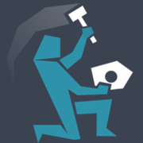

[](https://circleci.com/gh/NaKolenke/kolenka-frontend)
[](https://hitsofcode.com/view/github/NaKolenke/kolenka-frontend)

kolenka.net - это сайт небольшого коммьюнити разработчиков игр. В этом репозитории лежит фронтенд всего сайта. У нас есть блоги, в которые пользователи могут писать посты, а другие пользователи могут комментировать эти посты.


## Project setup
```
npm install
```

### Compiles and hot-reloads for development
```
npm run serve
```

### Compiles and minifies for production
```
npm run build
```

### Run your tests
```
npm run test
```

### Lints and fixes files
```
npm run lint
```

### Релиз
```
npm run release-patch
npm version [ major | minor | patch ] -m "Сообщение релиза"

git push --follow-tags
```

### Customize configuration
Для получения детальной информации о том, что тут происходит, смотри [Configuration Reference](https://cli.vuejs.org/config/).

## Как помочь

Выбери задачу из [таск-трекера](https://github.com/NaKolenke/kolenka-doc/projects/1), сделай форк, внеси изменения, протестируй, сделай пулл-реквест. Все просто!
